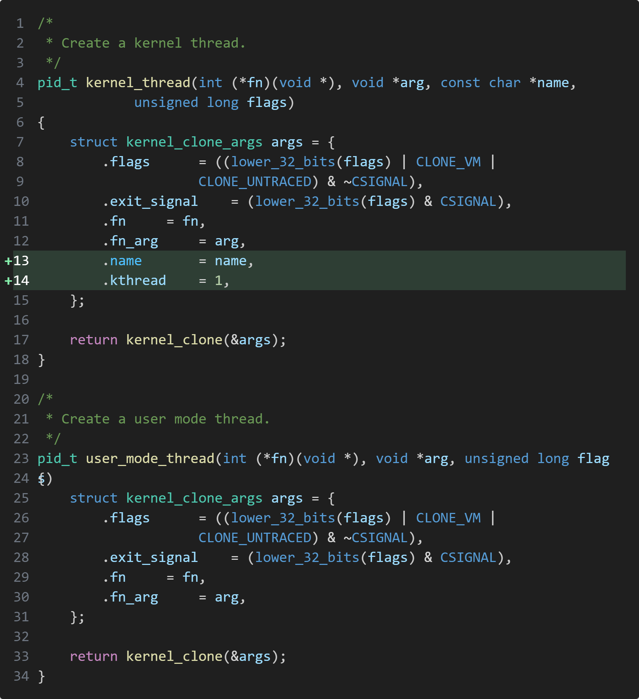

# init

在 linux 启动过程中的三个特殊进程 `idle` `init` 和 `kthreadd`

## idle 进程

[init/main.c](../../init/main.c) 文件中的 `start_kernel` 是一切的起点,在这个函数被调用之前都是系统的初始化工作(汇编语言),所以对内核的启动分析一般都从这个函数开始

这个函数在执行的过程中初始化、定义了内核中一些十分重要的内容,其执行过程几乎涉及到了内核的所有模块的初始化, 我们这里主要关注**进程初始化**的部分.

```c
void __init start_kernel(void)
{
	char *command_line;
	char *after_dashes;

	set_task_stack_end_magic(&init_task);
    // 一大堆 init
    rest_init();
}
```

首先第一行就使用 `set_task_stack_end_magic` 去初始化 `init_task`, 这个函数本身不稀奇, 只是单纯的为 init_task 添加一个栈溢出的标记保护位, 值得注意的是 `init_task` 变量本身, 它实际上是在 C 中被[初始化定义](https://github.com/luzhixing12345/klinux/blob/c58f2066740837b4fc7e1d12aedb5f1a045fef43/init/init_task.c#L64)的

> 在早期的一些版本(4.4)中也会使用 [INIT_TASK](https://github.com/torvalds/linux/blob/afd2ff9b7e1b367172f18ba7f693dfb62bdcb2dc/init/init_task.c#L18) 宏来进行[展开](https://github.com/torvalds/linux/blob/afd2ff9b7e1b367172f18ba7f693dfb62bdcb2dc/include/linux/init_task.h#L190), 效果是完全相同的

init_task 这个变量的 `comm` 字段的名字是 ["swapper"](https://github.com/luzhixing12345/klinux/blob/c58f2066740837b4fc7e1d12aedb5f1a045fef43/include/linux/init_task.h#L38), 这个字段在 `task_struct` 即进程结构体中的含义是[可执行文件的名字](https://github.com/luzhixing12345/klinux/blob/c58f2066740837b4fc7e1d12aedb5f1a045fef43/include/linux/sched.h#L1072-L1078)

> 初始(idle)进程的名字 swapper 其实就是从 UNIX 时代延续下来的, 曾经也有人给 linux 提过 [patch](https://www.uwsg.indiana.edu/hypermail/linux/kernel/0604.2/1270.html) 想要将名字改为 "idle" 但被拒绝了
>
>> Yes, swapper is because of historical reasons. In most text books for
>> Unix, the initial process on boot up is called "swapper". Probably
>> because those early Unix systems had this process handle the swapping
>> (as kswapd does today).
>> 
>> By doing this, it will probably make Linux out of sync with all the text
>> books on Unix, so it really is Linus' call.
>
> 回复的意思大致是说 swapper 的名字只是为了和 UNIX 系统保持一致

```c
#define INIT_TASK_COMM "swapper"

struct task_struct init_task = {
    // ...
	.comm = INIT_TASK_COMM
    //
    .prio = MAX_PRIO-20, // 优先级最低
    .mm = NULL // 由于init_task是一个运行在内核空间的内核线程, 因此其虚地址段mm为NULL
};
```

我们可以在开头打一个断点查看 init_task.comm 的字段, 确实为 "swapper"


或者在 gdb 中调试, 使用 `lx_current` 来获取当前进程, 可以看到当前 idle 进程的 pid 为 0, 且 comm 为 "swapper"

```bash
(gdb) p $lx_current().pid
$1 = 0
(gdb) p $lx_current().comm
$2 = "swapper\000\000\000\000\000\000\000\000"
```

> 结构体字段 `.pid` 并没有直接被赋值, 因为在 .data 段而默认初始化为 0

之后start_kernel()函数继续调用各个系统模块进行各种初始化之类的工作, 比如 `trap_init()`是中断向量的相关设置, `mm_init()`是内存管理的设置, `sched_init()`是调度模块的初始化

idle 运行在**内核态**, 在执行了上面的各项工作之后, 在 start_kernel() 函数的最后一行代码调用了另一个非常重要的函数 [rest_init](https://github.com/luzhixing12345/klinux/blob/c58f2066740837b4fc7e1d12aedb5f1a045fef43/init/main.c#L680), 创建了两个线程 `kernel_init` 和 `kthreadd`

```c
void rest_init(void)
{
    // ...
	pid = user_mode_thread(kernel_init, NULL, CLONE_FS); // 创建 1 号用户态线程
    // ...
	pid = kernel_thread(kthreadd, NULL, NULL, CLONE_FS | CLONE_FILES); // 创建 2 号内核线程
	// ...
}
```

kernel_thread 调用 kernel_clone 创建一个新的**线程**, 创建之初是线程, 随后后会**演变为进程**. 两个线程分别是用户态和内核态, 这两个函数的区别就在于 `kernel_clone_args` 中的 `.kthread = 1` 用于标记是否是内核态线程



`rest_init` 函数代码含义如下

```c
void __ref __noreturn rest_init(void)
{
    struct task_struct *tsk;
    int pid;
    rcu_scheduler_starting(); // 通知内核RCU子系统调度器正在启动

    // 首先需要启动init进程(通常获得PID 1),并且解释了如果kthreadd(内核线程管理进程)在init之前启动,可能会导致错误
    // 创建名为kernel_init的内核线程
    // pid = 1
    pid = user_mode_thread(kernel_init, NULL, CLONE_FS); 
    
    rcu_read_lock(); // 获取RCU读锁
    tsk = find_task_by_pid_ns(pid, &init_pid_ns); // 通过PID查找对应的任务结构
    tsk->flags |= PF_NO_SETAFFINITY; // 设置任务标志,禁止CPU亲和性设置
    set_cpus_allowed_ptr(tsk, cpumask_of(smp_processor_id())); // 将任务限制在启动CPU上执行
    rcu_read_unlock(); // 释放RCU读锁

    numa_default_policy(); // 设置NUMA的默认策略

    // 创建kthreadd内核线程
    // pid = 2
    pid = kernel_thread(kthreadd, NULL, NULL, CLONE_FS | CLONE_FILES);
    
    rcu_read_lock(); // 再次获取RCU读锁
    kthreadd_task = find_task_by_pid_ns(pid, &init_pid_ns); // 通过PID查找kthreadd任务结构
    rcu_read_unlock(); // 释放RCU读锁

    system_state = SYSTEM_SCHEDULING; // 设置系统状态为可调度状态
    complete(&kthreadd_done); // 完成kthreadd_done信号量,表示kthreadd初始化完成

    /*
     * The boot idle thread must execute schedule()
     * at least once to get things moving:
     */
    schedule_preempt_disabled(); // 执行调度,但禁用抢占式调度

    /* Call into cpu_idle with preempt disabled */
    cpu_startup_entry(CPUHP_ONLINE); // 调用CPU启动入口点,将CPU状态设置为在线
}
```

> 关于 RCU 的部分参见 [rcu](./rcu.md)

这里不会深入探讨有关 kernel_thread 实现的细节(我们将在描述调度程序详细展开).现在我们只需要知道我们用 kernel_thread 函数创建了新的内核线程 ,其中包含 `PID = 1` 的 init 进程和 `PID = 2` 的 kthreadd 进程, 进入 shell 之后也可以使用 ps 查看


idle 进程初始化的时候进程的优先级被设置为了 `.prio = MAX_PRIO-20`(120), 数值越低代表优先级越高, 因此 idle 实际上是**优先级最低**的一个进程

idle 进程最后调用 `cpu_startup_entry`, 此时该会变为idle进程, 让出CPU, 自己进入睡眠, 进入一个无限循环

```c
void cpu_startup_entry(enum cpuhp_state state)
{
	current->flags |= PF_IDLE;
	arch_cpu_idle_prepare();
	cpuhp_online_idle(state);
	while (1)
		do_idle();
}
```

## init

在rest_init函数中,内核将通过下面的代码产生第一个真正的进程(pid=1):

```c
kernel_thread(kernel_init, NULL, CLONE_FS);
```

这个进程就是着名的pid为1的init进程,它会继续完成剩下的初始化工作,然后execve(/sbin/init), 成为系统中的其他所有进程的祖先

init进程应该是一个用户空间的进程, 但是这里却是**通过kernel_thread的方式创建**的, 哪岂不是一个永远运行在**内核态的内核线程**么, 它是怎么演变为真正意义上**用户空间的init进程**的?

1号kernel_init进程完成linux的各项配置后(kernel_init_freeable),就会尝试执行 init 程序. 默认执行的 `ramdisk_execute_command` 初值为 ["/init"](https://github.com/luzhixing12345/klinux/blob/c58f2066740837b4fc7e1d12aedb5f1a045fef43/init/main.c#L159), 也可以在内核启动时(通过qemu)传递参数 [rdinit=](https://github.com/luzhixing12345/klinux/blob/c58f2066740837b4fc7e1d12aedb5f1a045fef43/init/main.c#L589-L599) 来指定位置; 如果没有找到或者执行出错则尝试执行 [init=](https://github.com/luzhixing12345/klinux/blob/c58f2066740837b4fc7e1d12aedb5f1a045fef43/init/main.c#L572-L587) 的参数, 否则去几个可能的位置 `/sbin/init` `/etc/init` `/bin/init` `/bin/sh` 尝试执行. 流程简化如下

```c
static int kernel_init(void *unused)
{
	int ret;

    kernel_init_freeable();
    // 一些初始化

    // rdinit=xxx
	if (ramdisk_execute_command) {
		ret = run_init_process(ramdisk_execute_command); // 执行 init
		if (!ret)
			return 0;
		pr_err("Failed to execute %s (error %d)\n",
		       ramdisk_execute_command, ret);
	}

	/*
	 * We try each of these until one succeeds.
	 *
	 * The Bourne shell can be used instead of init if we are
	 * trying to recover a really broken machine.
	 */
    // init=xxx
	if (execute_command) {
		ret = run_init_process(execute_command);
		if (!ret)
			return 0;
		panic("Requested init %s failed (error %d).",
		      execute_command, ret);
	}
    // 寻找其他可能的进程执行
	if (!try_to_run_init_process("/sbin/init") ||
	    !try_to_run_init_process("/etc/init") ||
	    !try_to_run_init_process("/bin/init") ||
	    !try_to_run_init_process("/bin/sh"))
		return 0;

	panic("No working init found.  Try passing init= option to kernel. "
	      "See Linux Documentation/init.txt for guidance.");
}
```

`run_init_process` 通过调用 [kernel_execve](https://github.com/luzhixing12345/klinux/blob/c58f2066740837b4fc7e1d12aedb5f1a045fef43/fs/exec.c#L1973-L2030) 来完成二进制文件的运行, 通过 alloc_bprm 来创建一个 **bprm**(binary program loader) 结构体, 然后调用 bprm_execve 执行

> 早期的 run_init_process 是直接使用 [do_execve](https://github.com/torvalds/linux/blob/afd2ff9b7e1b367172f18ba7f693dfb62bdcb2dc/init/main.c#L908-L914) 来执行 init 的, 后由 [be619f7](https://github.com/torvalds/linux/commit/be619f7f063a49c656f620a46af4f8ea3e759e91#diff-ff6060da281bd9ef3f24e17b77a9b0b5b2ed2d7208bb69b29107bee69732bd31) 实现了 kernel_execve 函数, 为了允许内核在不通过 set_fs(设置文件系统)的情况下执行二进制文件, 将原本在内核空间中使用 do_execve 函数的调用被替换为对 kernel_execve 的调用
> 
> ```c
> // 早期的实现
> static int run_init_process(const char *init_filename)
> {
>     argv_init[0] = init_filename;
>     return do_execve(getname_kernel(init_filename),
>         (const char __user *const __user *)argv_init,
>         (const char __user *const __user *)envp_init);
> }
> ```

## kthreadd

在rest_init函数中,内核将通过下面的代码产生第一个kthreadd(pid=2)

```c
kernel_thread(kthreadd, NULL, CLONE_FS | CLONE_FILES);
```

它的任务就是**管理和调度其他内核线程** kernel_thread, 会循环执行一个kthread的函数,该函数的作用就是运行kthread_create_list全局链表中维护的kthread, 当我们调用kernel_thread创建的内核线程会被加入到此链表中,因此所有的内核线程都是直接或者间接的以kthreadd为父进程

```c
#define list_entry(ptr, type, member) \
	container_of(ptr, type, member)

int kthreadd(void *unused) {
	struct task_struct *tsk = current;

	/* Setup a clean context for our children to inherit. */
	set_task_comm(tsk, "kthreadd"); // 设置名字为 kthreadd

	for (;;) {
        // 找到内核线程列表中的一个进行调度执行
		while (!list_empty(&kthread_create_list)) {
			struct kthread_create_info *create;

			create = list_entry(kthread_create_list.next,
					    struct kthread_create_info, list);
			list_del_init(&create->list);
			create_kthread(create);
		}
	}

	return 0;
}
```

## 参考

- [end of initialization](https://0xax.gitbooks.io/linux-insides/content/Initialization/linux-initialization-10.html)
- [systemd的作用](https://www.cnblogs.com/linhaostudy/p/8577504.html)
- [[linux]进程(三)_idle进程](https://blog.csdn.net/u013686805/article/details/19905941)
- [Linux下0号进程的前世(init_task进程)今生(idle进程)----Linux进程的管理与调度(五)【转】](https://cloud.tencent.com/developer/article/1339566)
- [Linux中的特殊进程:idle进程、init进程、kthreadd进程](https://blog.csdn.net/JoggingPig/article/details/110239518)
- [<Linux内核分析>(三)_跟踪分析Linux内核的启动过程](https://blog.csdn.net/FIELDOFFIER/article/details/44518597)
- [操作系统启动过程分析(使用qdb调试qume)](https://www.cnblogs.com/ppbb/p/12439184.html)